# Endolphine

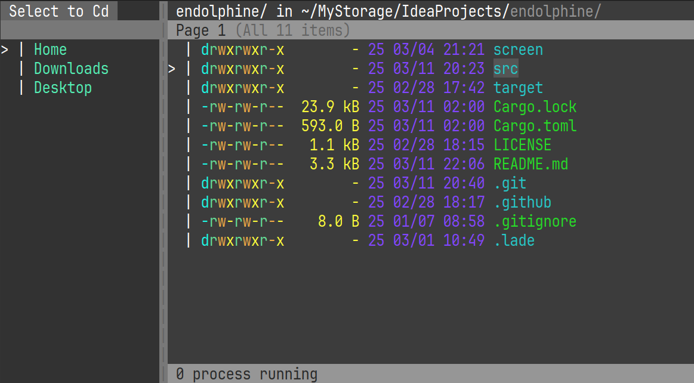

TUI file explorer made by Rust

# Installation

required [Cargo](https://www.rust-lang.org/tools/install):

```sh
cargo install endolphine
```

exec:

```
$ ep [PATH]

[PATH]: default "."
```

# Usage

### Launch explorer

```
$ ep [PATH]
```

Open in explorer with `PATH` directory.  
Cannot open a **NOT** directory items.

### Configuration

Open config file:

```sh
ep -e

# or

vim ~/.config/endolphine/config.toml
```

Default config:

```toml
# Editor to use
editor = ["vim"]

# theme to use (look "#Available themes")
theme = "Dark"

# OPTIONAL
# file path of user-defined theme
# Can't use variables
# if need the theme syntax, look the `example_theme.toml`
user_theme_path = "foo/bar/anyname.toml"

# Item sort priority
# 0: Prefix is lowercase (ex: "dotfiles/", "main.rs")
# 1: Prefix is uppercase (ex: "Desktop/", "Cargo.toml")
# 2: The "dotfiles" (ex: ".local/", ".git/")
# 3: Other files
sort_by_priority = [
    0,
    1,
    2,
    3,
]

[rm]
# Is ENTER required by question about the rm command
no_enter = true

# Will yank the file if the rm command runs
# This config disabled when "for_tmp" is disabled
yank = true

# Instead of deleting the item, the action is changed to moving it to the tmp_dir
for_tmp = true

[paste]
# A suffix that is added for collision avoidance when pasting into the same dir
copied_suffix = "_Copy"

# Won't ask "overwrite the same files?" when the paste command runs
force_mode = true

# Default answer to the "overwrite the same files?" question
default_overwrite = true

# Menu shortcuts
# Scheme: "Tag:Path"
#
# Tag: Name of be displaying on menu
# Path: Shortcut path (directory only)
#
# Important: **Can't** use the VARIABLE ($USER is example)
[menu]
items = [
    "Home:/home/${USER}",
    "Downloads:/home/${USER}/Downloads",
    "Desktop:/home/${USER}/Desktop",
]
```

### Keymapping

```toml
# Exit application
exit_app = "Q"

# Cursor moving
# *_ten is skip to 10 items, so FAST
move_up = "k"
move_up_ten = "K"
move_down = "j"
move_down_ten = "J"

# Back to a parent directory
move_parent = "h"

# If the target item is a file, it open with $EDITOR
# Enter it if that's a directory
enter_dir_or_edit = "l"

# Toggle the visual-selection mode
visual_select = "V"

# Toggle the MENU widget
menu_toggle = "M"

# Switch the MENU and BODY
menu_move = "m"

# Create a new file or directory
create_new = "a"

# Delete an item
delete = "d"

# Rename an item
rename = "r"

# Yank with the native-command (ex: xclip, wl-*)
yank = "y"

# Paste with the native-command (ex: xclip, wl-*)
paste = "p"

# Search an item in current directory
search = "/"
search_next = "n"
```

### Available themes

| Name       | Description                        |
| ---------- | ---------------------------------- |
| Dark       | Standard Dark theme                |
| Light      | Standard Light theme               |
| Mars       | Theme by imagined Mars             |
| Neon       | **WARNING**: It's bad for you eyes |
| Ice        | Looks Cold...                      |
| Nept       | Theme by imagined Neptune          |
| Volcano    | Looks VERY VERY **HOT**...         |
| Mossy      | Stone in Coniferous forest         |
| Monochrome | Probably the 1900s                 |
| Holiday    | **_HAPPY HOLIDAY_**                |
| Bloom      | Are the flowers... blooming?       |
| Collapse   | Liquid of Collapse                 |

<details><summary>Open theme preview</summary>

#### Dark

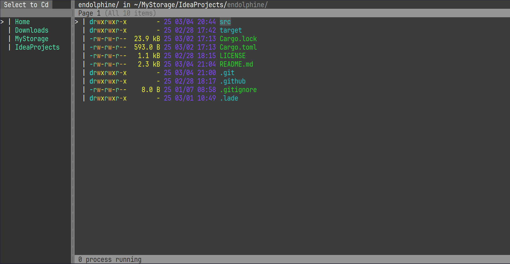

#### Light

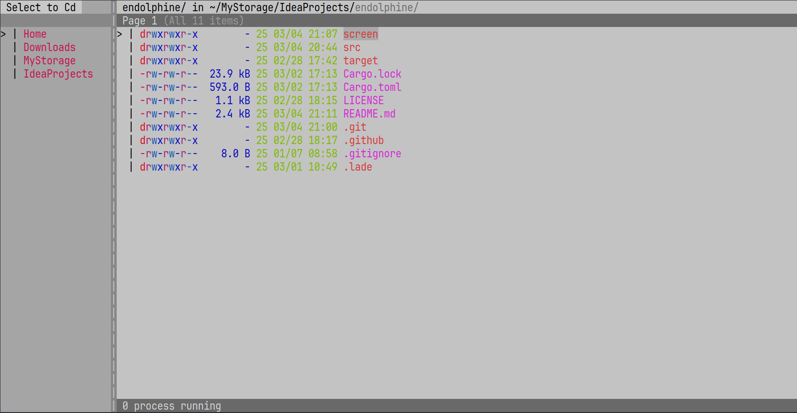

#### Mars

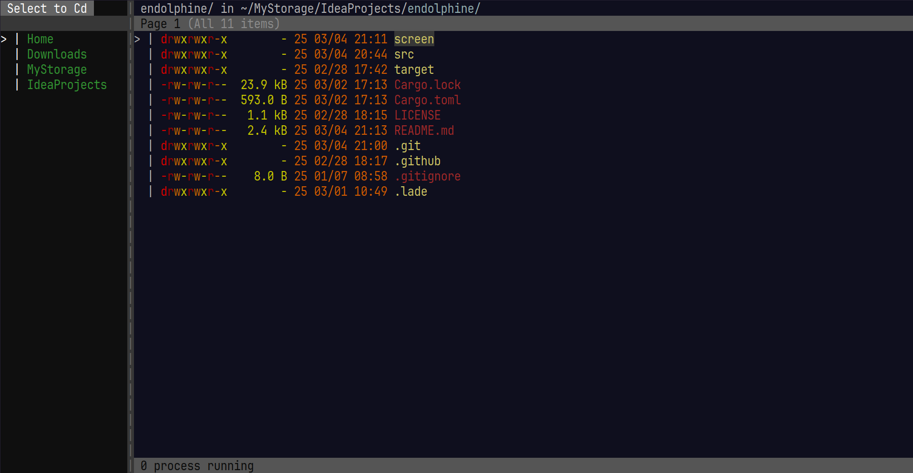

#### Neon


#### Ice

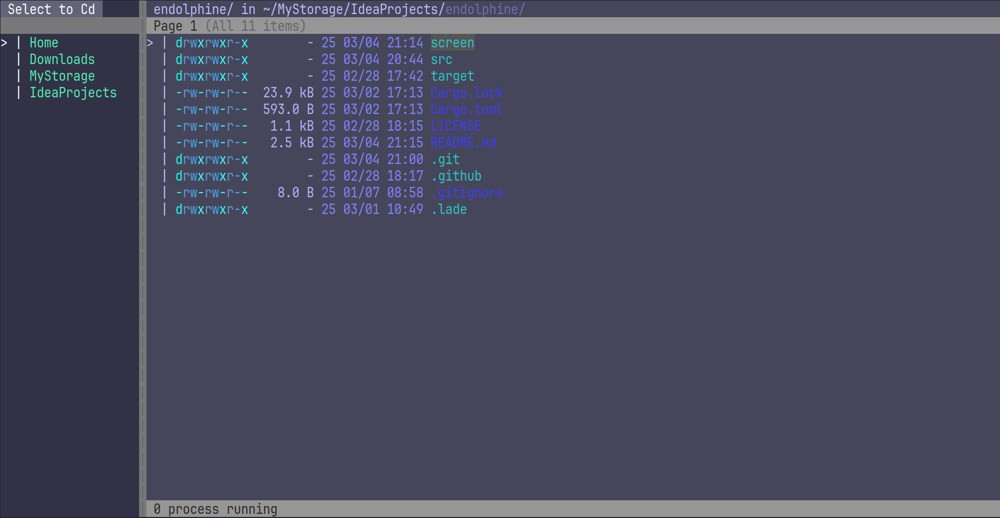

#### Nept

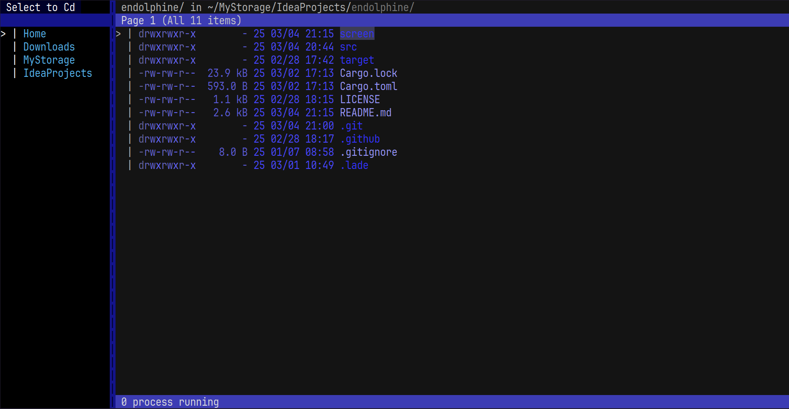

#### Volcano

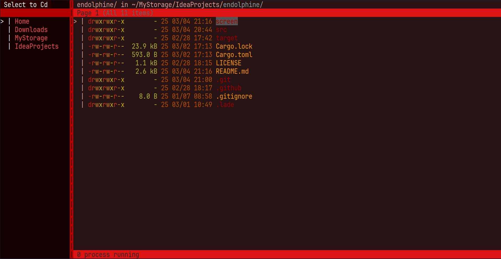

#### Mossy

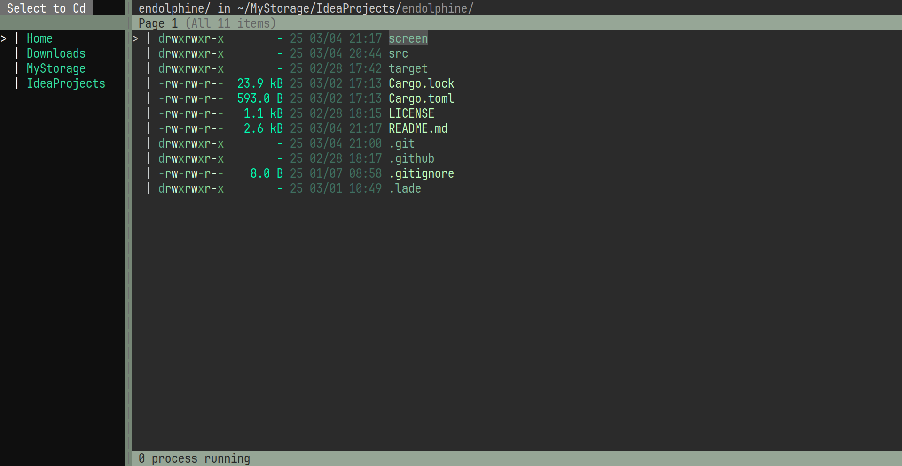

#### Monochrome

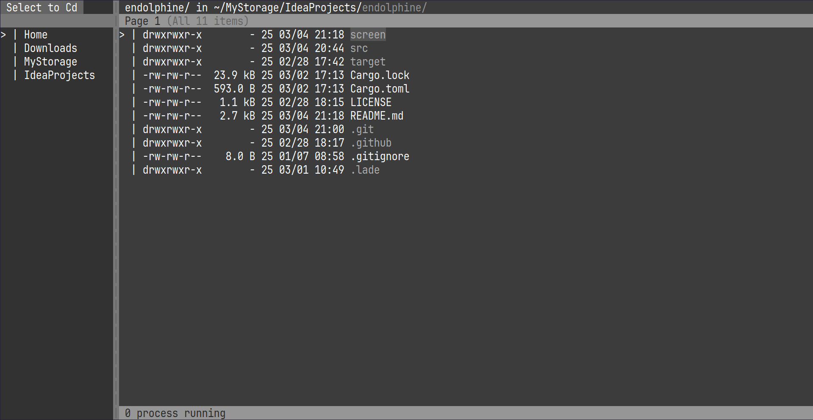

#### Holiday

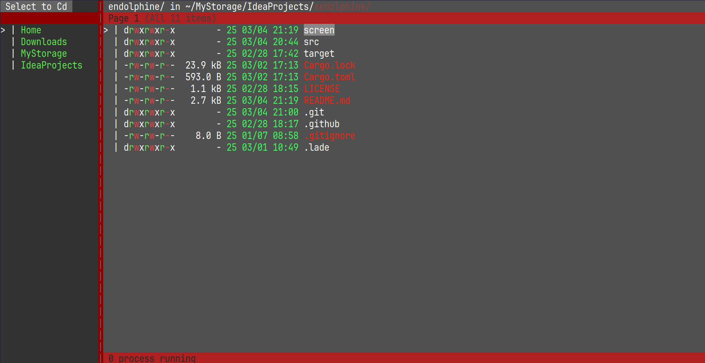

#### Bloom

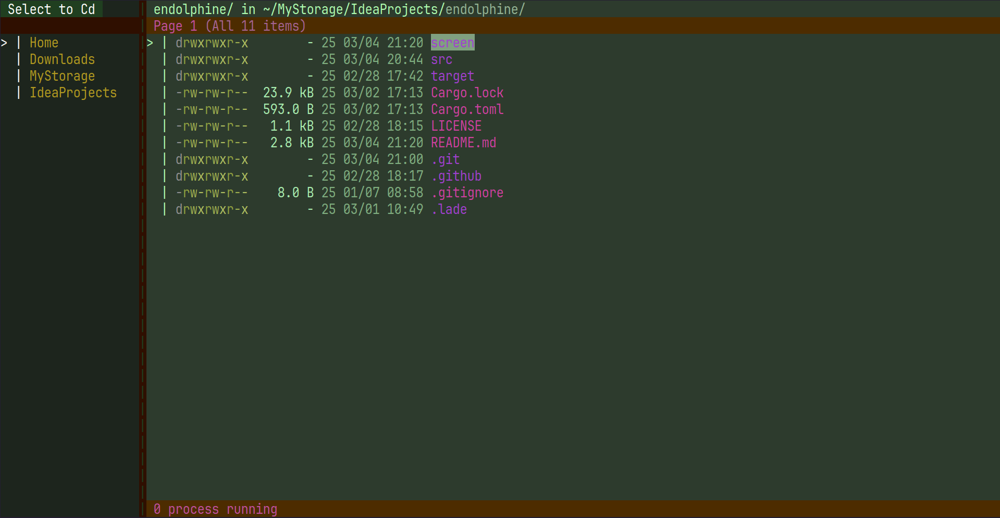

#### Collapse

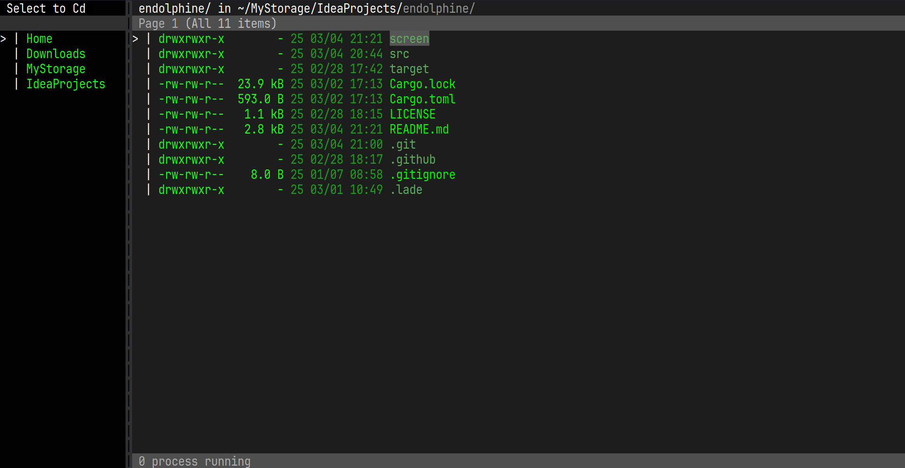

</details>

# Uninstall

required [Cargo](https://www.rust-lang.org/tools/install):

```sh
cargo uninstall endolphine
```

# TODO

- Impl for the multi-key command system
- Add a config for command override that open it by extension
- Support MacOS (NEVER SUPPORT for **WINDOWS**)
- Add a logger to file
- Impl for the realtime displaying system
- Improve the search logic (Now: contains TEXT)
- Impl for the application-level yank and paste
- Add a command mode
- Improve the rendering system to nvim like
  - Make renderings independently as one "window" per grid
  - Allow widgets to be rendered to variable size
    - When viewed from inside the renderer, it is assumed that (0, 0) to (x, y) of the "window" to be rendered can be used
  - Impl for the floating window
  - Add component rendering
- Impl the layout system and logic (ratatui?)

## LICENSE

MIT
