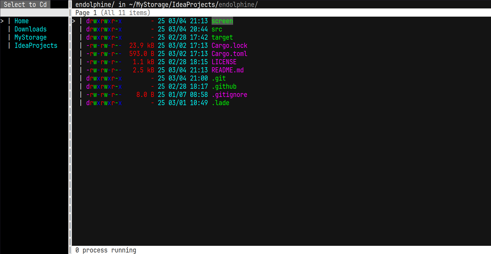

# Endolphine


TUI file explorer made by Rust

# Installation

required [Cargo](https://www.rust-lang.org/tools/install):

```sh
cargo install endolphine
```

exec:

```
$ ep [PATH]

[PATH]: default "."
```

# Usage

### Launch explorer

```
$ ep [PATH]
```

Open in explorer with `PATH` directory.  
Cannot open a **NOT** directory items.

### Configuration

Open config file:

```sh
ep -e

# or

vim ~/.config/endolphine/config.toml
```

Default config:

```toml
# Editor to use
editor = ["vim"]

# theme to use (look "#Available themes")
theme = "Dark"

# OPTIONAL
# file path of user-defined theme
# Can't use variables
# if need the theme syntax, look the "#Example user theme"
user_theme_path = "foo/bar/anyname.toml"

# Item sort priority
# 0: Prefix is lowercase (ex: "dotfiles/", "main.rs")
# 1: Prefix is uppercase (ex: "Desktop/", "Cargo.toml")
# 2: The "dotfiles" (ex: ".local/", ".git/")
# 3: Other files
sort_by_priority = [
    0,
    1,
    2,
    3,
]

[delete]
# Whether to ask again when you enter the delete key
ask = true

# Will yank the file if the rm command runs
# This config disabled when "for_tmp" is disabled
yank = true

# Instead of deleting the item, the action is changed to moving it to the tmp_dir
for_tmp = true

[paste]
# A suffix that is added for collision avoidance when pasting into the same dir
copied_suffix = "_Copy"

# Won't ask "overwrite the same files?" when the paste command runs
force_mode = true

# Default answer to the "overwrite the same files?" question
default_overwrite = true

# Menu shortcuts
# Scheme: "Tag:Path"
#
# Tag: Name of be displaying on menu
# Path: Shortcut path (directory only)
#
# Important: **Can't** use the VARIABLE ($USER is example)
[menu]
items = [
    "Home:/home/${USER}",
    "Downloads:/home/${USER}/Downloads",
    "Desktop:/home/${USER}/Desktop",
]

# User-defined keymapping

# In normal mode mapping
# Normal mode is default mode, the basic operation is available
# OPTIONAL
[keymap.normal]

# Examples
# K = "10k"
# J = "10j"
# Q = "ZZ"
# "<c-e>" = "ZZ"

# In visual mode mapping
# Visual mode is area-selecting mode, move cursor to change selected area
# OPTIONAL
[keymap.visual]

# Example
# "<c-v>" = "ggVG"

# In input mode mapping
# Input mode is focus input area
# OPTIONAL
[keymap.input]

# Example
# "<c-e>" = "<ESC>"

# Override the file open command by extension
# OPTIONAL
[open]

# Format:
# EXTENSION = { cmd = ["command"], in_term = bool }
#
# cmd = ["COMMAND", "ARGS1", "ARGS2", ...]
# in_term: if command processing in the terminal
# in_term is OPTIONAL (default: true)

# Example:
# txt = { cmd = ["nvim"] }
```

### Keymapping

| Mode                 | Keymap       | Desc                                                                       |
| -------------------- | ------------ | -------------------------------------------------------------------------- |
| Normal, Visual       | `ZZ`         | Exit application                                                           |
| Normal               | `<ESC>`      | Some reset                                                                 |
| Visual               | `<ESC>`      | Change to normal mode                                                      |
| Normal, Menu         | `k`          | Move cursor up                                                             |
| Visual               | `k`          | Move cursor up and select item                                             |
| Normal, Menu         | `j`          | Move cursor down                                                           |
| Visual               | `j`          | Move cursor down and select item                                           |
| Menu                 | `K`          | Move cursor to top                                                         |
| Menu                 | `J`          | Move cursor to bottom                                                      |
| Normal, Visual       | `h`          | Open parent directory and change to normal mode                            |
| Normal, Visual       | `gg`         | Move cursor to top                                                         |
| Normal, Visual       | `G`          | Move cursor to bottom                                                      |
| Normal, Visual       | `gk`         | Move cursor up per page                                                    |
| Normal, Visual       | `gj`         | Move cursor down per page                                                  |
| Normal, Visual       | `l`          | Open under cursor item                                                     |
| Normal, Visual       | `V`          | Toggle Normal and Visual mode                                              |
| Normal, Visual, Menu | `M`          | Toggle Menu widget                                                         |
| Normal, Visual, Menu | `m`          | Toggle Menu focus                                                          |
| Normal, Visual       | `a`          | Ask create item and change to normal mode                                  |
| Normal, Visual       | `d`          | (if config delete.ask = true) Ask delete file(s) and change to normal mode |
| Normal               | `dd`         | Delete under cursor item                                                   |
| Visual               | `d`          | Delete selected items                                                      |
| Normal, Visual       | `r`          | Ask rename item and change to normal mode                                  |
| Normal               | `yy`         | Yank under cursor item                                                     |
| Visual               | `y`          | Yank selected items                                                        |
| Normal, Visual       | `p`          | Paste from clipboard                                                       |
| Normal, Visual       | `/`          | Open search input and change to normal mode                                |
| Normal, Visual       | `n`          | Move cursor to next by search                                              |
| Input                | `a`..`Z`, .. | Push key to input                                                          |
| Input                | `<c-h>`      | Move cursor to previous                                                    |
| Input                | `<c-l>`      | Move cursor to next                                                        |
| Input                | `<BS>`       | Delete current char in input                                               |
| Input                | `<s-BS>`     | Delete next char in input                                                  |
| Input                | `<CR>`       | Complete input                                                             |
| Input                | `<ESC>`      | Espace from input                                                          |

### Available themes

| Name       | Description                        |
| ---------- | ---------------------------------- |
| Dark       | Standard Dark theme                |
| Light      | Standard Light theme               |
| Mars       | Theme by imagined Mars             |
| Neon       | **WARNING**: It's bad for you eyes |
| Ice        | Looks Cold...                      |
| Nept       | Theme by imagined Neptune          |
| Volcano    | Looks VERY VERY **HOT**...         |
| Mossy      | Stone in Coniferous forest         |
| Monochrome | Probably the 1900s                 |
| Holiday    | **_HAPPY HOLIDAY_**                |
| Bloom      | Are the flowers... blooming?       |
| Collapse   | Liquid of Collapse                 |

<details><summary>Open theme preview</summary>

#### Dark


#### Light


#### Mars


#### Neon



#### Ice


#### Nept


#### Volcano


#### Mossy


#### Monochrome


#### Holiday


#### Bloom


#### Collapse


</details>

<details><summary>Example user theme</summary>

```toml
fg_focused = "#FFFFFF"
fg_unfocused = "#FFFFFF"
bg_focused = "#505050"
bg_unfocused = "#3C3C3C"
label = "#646464"
bar = "#AF2020"
bar_dark = "#8F0000"
unnecessary_text = "#8F4040"
bar_text = "#282828"
bar_text_light = "#3F3F3F"
perm_ty = "#FFFFFF"
perm_r = "#60EF06"
perm_w = "#EF4040"
perm_e = "#FFFFFF"
row_file = "#FF2010"
row_dir = "#FFFFFF"
row_symlink = "#C828C8"
row_broken = "#200000"
row_cursor = "#888888"
row_bsize = "#FFFFFF"
row_mod_time = "#40FF60"
select = "#F2F2F2"
input = "Reset"
menu_tag = "#60F050"
search_surround = "#60F050"
```

</details>

# Uninstall

required [Cargo](https://www.rust-lang.org/tools/install):

```sh
cargo uninstall endolphine
```

# TODO

- Impl for the realtime displaying system
- Improve input mode
- Add a command mode
- Replace globals into the "state"
- Improve the rendering system to nvim like
  - Make renderings independently as one "window" per grid
  - Allow widgets to be rendered to variable size
    - When viewed from inside the renderer, it is assumed that (0, 0) to (x, y) of the "window" to be rendered can be used
  - Impl for the floating window
  - Add component rendering
- Impl the layout system and logic (ratatui?)
- Improve sys_log
- Impl the plugin-system

## LICENSE

MIT
